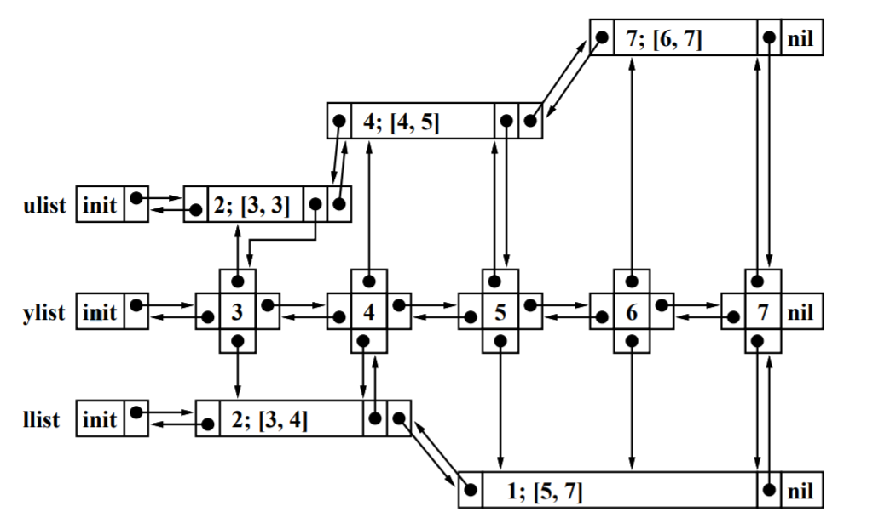

.. include:: ./definitions.rst

****************************************
Common Intervals - Article
****************************************

Notation
==========================

|sigA|, |sigB|
----------------
The permutations we try to find common intervals for

* :math:`\sigma_A(i) = \alpha` denotes that |alpha| is the character at index |i|
* :math:`\sigma_A^{-1}(\alpha) = i` denotes that the index of |alpha| in |sigA| is |i|

|Pi_AB|
--------------

* :math:`\Pi_{AB}(i) = \sigma_B^{-1}(\sigma_A(i))`
    * Meaning - :math:`\Pi_{AB}(i) = j` the :math:`ith` element of |A| shows up at index |j| in |B|

Functions used in common intervals for |sigA| and |sigB|
-----------------------------------------------------------------------------

* :math:`l(x, y) = min(\Pi_{AB}(i) : i \in [x, y])`
    * The minimal / most left index of the the items in B that are at A at indices [x, y]

* :math:`u(x, y) = max(\Pi_{AB}(i) : i \in [x, y])`
    * The maximal / most right index of the the items in B that are at A at indices [x, y]

* :math:`f(x, y) = u(x, y) - l(x, y) - (y - x)`
    * :math:`f(x,y)` is the number of elements in
      :math:`\{ \sigma_B(i) | i \in [l(x,y), u(x,y)] \} - \{ \sigma_A(i) | i \in [x,y] \}`

    * (**Most right** - **most left**) - is the size of the interval in B, that contains all the elements from
      :math:`\sigma_A[x, y]`

    * Thus, |f_x_y| is the size of interval mentioned above,
        minus the same interval in A (which is just :math:`(x - y)`)

Wasteful |y|
------------------
* For a fixed |x| we call a |y| **wasteful** if :math:`f(x', y) > 0 : x' \leq x`
* Meaning that nor :math:`[x,y]` or any interval extended to the left is of the same **"size"** in A and B

Identifying wasteful |y|
-----------------------------

1. For some :math:`x>1 \; y>x` - if

  * :math:`u(x,y) < u(x, y')`
  * but :math:`u(x-1,y) = u(x-1, y')`  for some  :math:`y' > y`
  * Then :math:`f(x' y) > 0 for all x'< x`

2. For some :math:`x>1 y>x` - **If**

  * :math:`f(x,y) > f(x,y')` for some :math:`y' > y`
  * **Then** :math:`f(x' y) > 0` for all :math:`x' \leq x`

3 proposed algorithms:
============================

1. **LHP** -  simple |On2| time algorithm, whose expected running time becomes: |On| for two randomly generated permutations
2. **MNG** - A practically fast |On2| time algorithm using the reverse Monge property
3. **RC** - an :math:`O(n + K)` time algorithm, where :math:`K \leq \binom{n}{2}` is the number of common interval

RC
===========

Lists (Y) - computed for each |x|
----------------------------------

ylist
************
* Initialized with indices 1..N
* For each iteration of |x| we remove from ylist (and ulist/llist) wasteful |y| values
* each node of ylist is linked to ulist/llist at relevant values - :math:`u(x, y') ; l(x,y')`

ulist / llist
*****************

* For a fixed |x| - ulist(|x|, y) - is composed of segments:

  * Each segment is of the structure :math:`[u_{val}; y_{start} - y_{end}]`,
    where :math:`y_{start}/y_{end}` is the index range for which
    :math:`u(x,y') = u_{val} : y' \in [y_{start},y_{end}]`

  * Each segment is linked to ylist at :math:`y_{end}(segment)`

Updating upon :math:`x \rightarrow x-1`
******************************************
