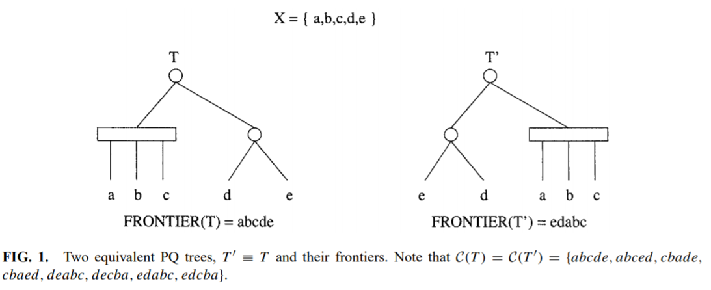
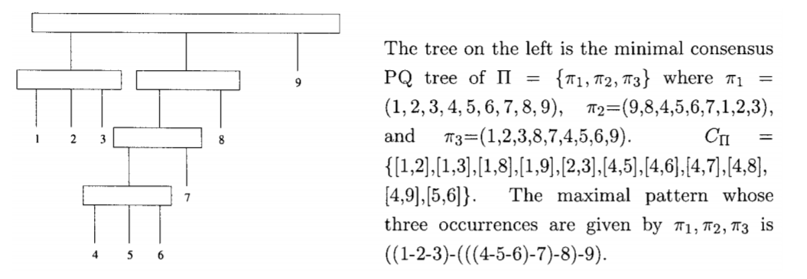

**************************
PQ Trees - Article
**************************

.. |eqq| replace:: :math:`\equiv`
.. |iff| replace:: :math:`\leftrightarrow`

.. |pi| replace:: :math:`\pi`
.. |Pi| replace:: :math:`\Pi`
.. |Sig| replace:: :math:`\Sigma`
.. |C_Pi| replace:: :math:`C_{\Pi}`
.. |T_C| replace:: :math:`T_C`

.. |p1| replace:: :math:`p_1`
.. |p2| replace:: :math:`p_2`
.. |T1| replace:: :math:`T_1`
.. |T2| replace:: :math:`T_2`
.. |C_T| replace:: :math:`C(T)`
.. |REDUCE| replace:: :math:`REDUCE(I, T')`

Key points
=================

Pattern
-------------
Let the pattern :math:`P = p_1 , ... , p_m`
and the string :math:`S = s_1, s_2,...,s_n` be both sequences of characters (with possible repeats)
over a given alphabet  (in our case genes). P appears in location i in S iff
:math:`(p_1, p_2,...,p_m)` is a permutation of :math:`(s_i, s_{i+1},...,s_{i+m-1})`.

|pi| Pattern
----------------
*P* is considered a |pi| *pattern* if it appears in *S* -
*K* times for a given *K*.

|pi| Maximal
---------------
A pattern |p1| is *nonmaximal* with respect to |pi| pattern |p2|,
if each occurrence of |p1| is covered by an occurrence of |p2| and each occurrence of |p2|
covers an occurrence of |p1|.

Maximal notation
-------------------
Given *k* permutations on an alphabet |Sig|, representing *k* occurrences
of a pattern, the maximal notation is obtained by using a "-" between two groups
of one or more genes to denote that these groups appear as immediate neighbors
in all the k permutations, and using a "," otherwise.

Example
^^^^^^^^^^^
Consider the pattern :math:`\{a, b, c, d, e, f \}` appearing once as "abcdef" and once as "bdacfe";
then the maximal notation of this pattern is :math:`((a, b, c, d) - (e - f ))`.

PQ Tree
------------
A PQ tree is a rooted tree whose internal nodes are of two types: P and Q.

* The children of a **P-node** occur in no particular order
* The children of a **Q-node** appear in a left-to-right or right-to-left order.
* We designate a P-node by a circle and a Q-node by a rectangle.
* The leaves of T are labeled bijectively by the elements of X.
* **The frontier** of a tree T , denoted by F (T ), is the
  permutation of X obtained by reading the labels of the leaves from left to right.

Equivalent PQ trees
^^^^^^^^^^^^^^^^^^^^^^^^
Two PQ trees T and T' are equivalent, denoted T |eqq| T',
if one can be obtained from the other by applying a sequence of the following transformation rules:

1. arbitrarily permute the children of a P-node
2. reverse the children of a Q-node.

|C_T|
^^^^^^
Any frontier obtainable from a tree equivalent with T is considered consistent with T,
and |C_T| is defined as follows: |C_T| = :math:`\{F(T')|T \equiv T'\}`.

* We accordingly define the number of frontiers obtainable from a tree
  equivalent with T to be | |C_T| |

Theorem 2
^^^^^^^^^^^^^
For two PQ trees |T1| and |T2|, :math:`if C(T_1) = C(T_2)`, then |T1| |eqq| |T2|

Canonical PQ tree
^^^^^^^^^^^^^^^^^^
A PQ tree that has:

1. No node with only one child
2. No P node with only two children.

|REDUCE|
-----------------------
Given a collection I of subsets of :math:`N = \{1, 2,...,n\}` and a PQ tree T'
whose leaves are :math:`\{1, 2,...,n\}`, the function |REDUCE| builds a PQ tree T
such that :math:`f \in C(T)` |iff| :math:`f \in C(T')`
and every :math:`i \in I` appears as a consecutive substring of f.

Minimal consensus PQ tree
------------------------------

|Pi|
^^^^^^^^^^
The set of k permutations :math:`\pi_1, \pi_2, ..., \pi_k` representing k occurrences
of a  |pi| pattern :math:`N = \{1, 2,...,n\}`.

Definition
^^^^^^^^^^^^^^^
Given |Pi|, A consensus PQ tree T of |Pi| is such that :math:`\Pi \subseteq C(T)`,
and the consensus PQ tree is minimal when there exists no :math:`T' \nequiv T` such that
:math:`\Pi \subseteq C(T')'`  and  :math:`|C(T')| < |C(T)|`.

Common interval (|C_Pi|)
---------------------------
Given |Pi|, w.l.o.g. we assume that :math:`\pi_1 = id_n \coloneqq (1, 2, . . . , n)`.
An interval :math:`[i, j ] (1 \leq i<j \leq n)` is called a common interval of |Pi| iff
the elements of the set :math:`\{i, i+1,...,j \}` appear as a consecutive substring
in every :math:`\pi_i \in \Pi (i = 1, 2,... , k)`. The set of all common intervals of
|Pi| is denoted |C_Pi|.

Theorem 1
-------------
Given :math:`\Pi, T_C = REDUCE(C_\Pi, T_U)` is a minimal consensus PQ tree of |Pi|.
